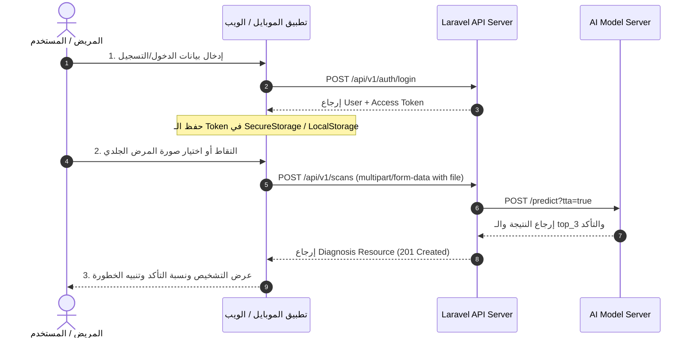

# 📱 دليل ربط الموبايل والويب (Mobile & Web Integration Guide)

دليل إرشادي سريع لمطوري تطبيقات الموبايل والويب لبناء واجهات المستخدم والربط السلس مع API تشخيص الأمراض الجلدية.

---

## 🎯 1. خطوات الربط الترتيبية (Integration Workflow)



---

## 💡 2. أمثلة كود جاهزة للاستخدام (Code Snippets)

### 2.1 مثال بلغة Flutter / Dart (`http` package)

```dart
import 'dart:convert';
import 'dart:io';
import 'package:http/http.dart' as http;

class SkinScanRepository {
  final String baseUrl = 'http://localhost:8000/api/v1';

  Future<Map<String, dynamic>> uploadSkinScan({
    required File imageFile,
    required String userToken,
    bool tta = true,
  }) async {
    final uri = Uri.parse('$baseUrl/scans');
    final request = http.MultipartRequest('POST', uri)
      ..headers['Authorization'] = 'Bearer $userToken'
      ..headers['Accept'] = 'application/json'
      ..fields['tta'] = tta.toString()
      ..files.add(await http.MultipartFile.fromPath('file', imageFile.path));

    final streamedResponse = await request.send();
    final response = await http.Response.fromStream(streamedResponse);

    if (response.statusCode == 201) {
      return jsonDecode(response.body);
    } else {
      throw Exception('فشل فحص الصورة: ${response.body}');
    }
  }
}
```

---

### 2.2 مثال بلغة JavaScript / Axios (React / React Native)

```javascript
import axios from 'axios';

const API_BASE_URL = 'http://localhost:8000/api/v1';

export const uploadSkinScan = async (imageUri, userToken) => {
  const formData = new FormData();
  formData.append('file', {
    uri: imageUri,
    type: 'image/jpeg',
    name: 'skin_lesion.jpg',
  });
  formData.append('tta', 'true');

  const response = await axios.post(`${API_BASE_URL}/scans`, formData, {
    headers: {
      'Authorization': `Bearer ${userToken}`,
      'Accept': 'application/json',
      'Content-Type': 'multipart/form-data',
    },
  });

  return response.data;
};
```

---

## 🎨 3. نصائح أفضل الممارسات للواجهات (UI Best Practices)

1. **عرض تنبيه الخطورة (`is_malignant`):**
   - إذا كانت قيمة `is_malignant: true` (مثل حالات `mel` أو `bcc` أو `akiec`):
     - اعرض شارة تحذيرية باللون الأحمر ⚠️: **"حالة تتطلب استشارة طبيب جلدية متخصص فورا"**.
   - إذا كانت `is_malignant: false` (مثل `nv` أو `bkl`):
     - اعرض شارة باللون الأخضر 🟢: **"حالة حميدة غالباً - يُنصح بالمتابعة الدورية"**.

2. **عرض شريط نسبة التأكد (`confidence_percentage`):**
   - استخدم قيمة `confidence` (مثال: `0.989399` => `98.94%`) لعرض Progress Bar متحرك ملفت للمستخدم.

3. **قائمة الاحتمالات الثلاثة الأولى (`top_3`):**
   - اعرض قائمة الـ `top_3` تحت التشخيص الرئيسي لتزويد الطبيب أو المريض بالاحتمالات البديلة التي قدرها الذكاء الاصطناعي.
